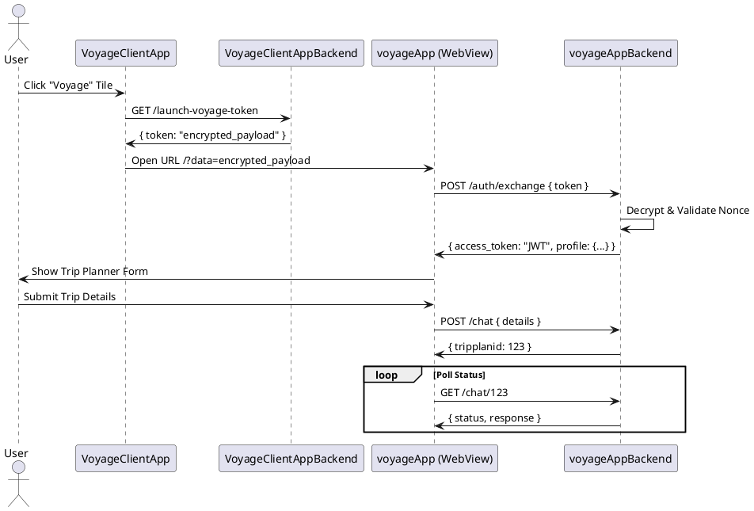

# Voyage System

A comprehensive ecosystem simulating a banking environment integrating a travel micro-app ("Voyage").

## Architecture

The system consists of 4 components:
1.  **VoyageClientApp**: React Native mobile banking app.
2.  **VoyageClientAppBackend**: FastAPI backend for the banking app (handles encryption).
3.  **voyageApp**: Next.js web application for travel planning (embedded via WebView).
4.  **voyageAppBackend**: FastAPI backend for the travel app.

### Communication Flow (Mermaid)

```mermaid
graph TD
    User[User] -->|Opens| ClientApp[VoyageClientApp (React Native)]
    ClientApp -->|1. Get Token| ClientBackend[VoyageClientAppBackend]
    ClientBackend -->|2. Return Encrypted Token| ClientApp
    ClientApp -->|3. Open WebView with Token| VoyageApp[voyageApp (Next.js)]
    VoyageApp -->|4. Exchange Token| VoyageBackend[voyageAppBackend]
    VoyageBackend -->|5. Validate & Issue JWT| VoyageApp
    VoyageApp -->|6. Chat & Plan| VoyageBackend
```

### Sequence Diagram (PlantUML)



## Setup & Running

### Prerequisites
*   Docker & Docker Compose
*   Node.js & npm (for local dev)
*   Python 3.11+ (for local dev)

### Running with Docker
```bash
docker-compose up --build
```
*   VoyageClientAppBackend: http://localhost:8000
*   voyageAppBackend: http://localhost:8001
*   voyageApp: http://localhost:3001

### Running Locally

#### 1. VoyageClientAppBackend
```bash
cd voyage-client-backend
uv venv
uv pip install -r requirements.txt
uvicorn main:app --reload --port 8000
```

#### 2. voyageAppBackend
```bash
cd voyage-app-backend
uv venv
uv pip install -r requirements.txt
uvicorn main:app --reload --port 8001
```

#### 3. voyageApp
```bash
cd voyage-app
npm install
npm run dev
# Runs on localhost:3000
```

#### 4. VoyageClientApp
```bash
cd voyage-client-app
npm install
npx expo start
# Press 'w' for web, or scan QR code with Expo Go
```
